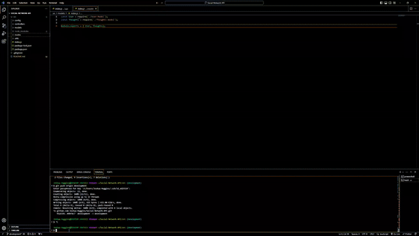

# Social-Network-API

## Description

This is the back end of a Social Network Api that will use a NoSQL database to handle a large amout of unstructured data for a website. Due to the populartiy of MongoDB, the back end has been set up making use its speed to handle large amounts of data. Since this is just the back end portion, insomia will be important for our CRUD operations regarding the data.

## Installation and Usage

Downloading the repo will download all dependencies and code needed to run the index.js. Since this is a NoSQL there is no need to drop a database and there are no seeds since we are adding the data through insomnia.
Use npm i in order to make sure all dependencies are correctly setup and ready to be used. Running "node index.js" will start up the server that will allow you to use insomia to view all users and their friends, as well as thoughts and the reactions to them. Please refer to the emo down below if you need a visual guide. 

## Demo

for a video walkthrough of the gif follow this link:

Full Insomnia walkthrough: https://www.youtube.com/watch?v=lwm0DBzjtyE

